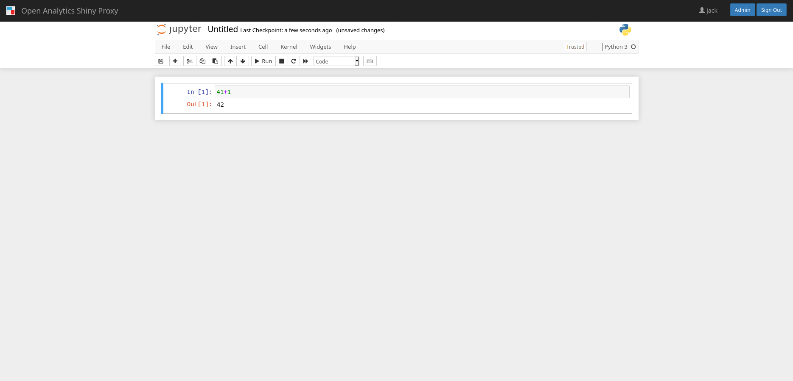
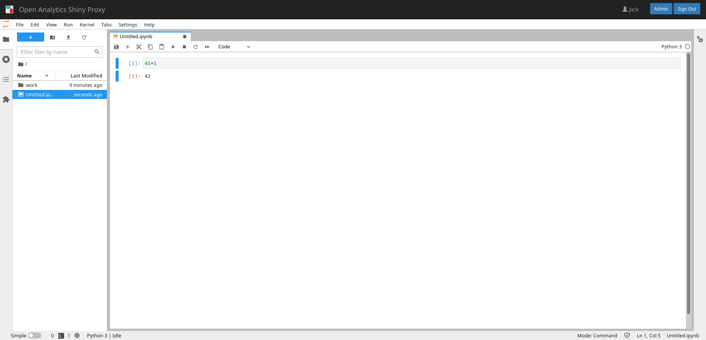

# Running Jupyter notebooks inside ShinyProxy

[Screenshots](#screenshots)

ShinyProxy can run Jupyter notebooks using one of their [official Docker images](https://jupyter-docker-stacks.readthedocs.io/en/latest/using/selecting.html).
However, you can adapt these Docker images, such that links inside the notebook are
not opened in a new tab. See the [official documentation](https://jupyter-notebook.readthedocs.io/en/stable/public_server.html#embedding-the-notebook-in-another-website).
In addition, you may want to mount a volume for persisting your notebooks. In
that case you need to tell the image to use the correct permissions for the
volume. Both changes are applied in the `openanalytics/shinyproxy-juypter-datascience`
image. This image is built from the [Dockerfile](Dockerfile) in this repo.

## Usage

**Note:** this configuration makes use of a new configuration option, which is
not yet available in a stable release of ShinyProxy. Therefore you have to use
the snapshot release
`openanalytics/shinyproxy-snapshot:2.5.1-SNAPSHOT-20210521.074523` or [the
respective jar file](https://nexus.openanalytics.eu/repository/snapshots/eu/openanalytics/shinyproxy/2.5.1-SNAPSHOT/shinyproxy-2.5.1-20210521.074523-12.jar).

Create a ShinyProxy configuration file (see [application.yml](application.yml) for a complete file)

```yaml
- id: jupyter-notebook
  display-name: Jupyter Notebook
  description: Jupyter Notebook is a web-based interactive computational environment for creating Jupyter notebook documents.
  container-cmd: ["start-notebook.sh", "--NotebookApp.token=''", "--NotebookApp.base_url=#{proxySpec.containerSpecs[0].env.get('SHINYPROXY_PUBLIC_PATH')}"]
  container-image: openanalytics/shinyproxy-juypter-datascience
  container-volumes: [ "/tmp/jupyter/#{proxy.userId}/work:/home/jovyan/work"]
  port: 8888
  target-path: "#{proxySpec.containerSpecs[0].env.get('SHINYPROXY_PUBLIC_PATH')}"
- id: jupyter-notebook-lab
  display-name: Jupyter Notebook Lab
  description: Jupyter Notebook running in lab mode.
  container-cmd: ["start-notebook.sh", "--NotebookApp.token=''", "--NotebookApp.base_url=#{proxySpec.containerSpecs[0].env.get('SHINYPROXY_PUBLIC_PATH')}"]
  container-image: openanalytics/shinyproxy-juypter-datascience
  container-volumes: [ "/tmp/jupyter/#{proxy.userId}/work:/home/jovyan/work"]
  port: 8888
  target-path: "#{proxySpec.containerSpecs[0].env.get('SHINYPROXY_PUBLIC_PATH')}"
  container-env:
    JUPYTER_ENABLE_LAB: yes
```

Note: this will mount `/tmp/jupyter/#{proxy.userId}` as the workspace for
storing the Jupyter notebooks. You can save your notebooks in the `work`
directory. The next time you start the Jupyter application (i.e. after logging
out), your files are available again.

## Feedback

Since the support for Jupyter notebooks will be introduced in the next release
of ShinyProxy, we are looking forward to any feedback you have. Let us know if
you encounter any issue with running these notebooks.

## Screenshots





**(c) Copyright Open Analytics NV, 2021.**
